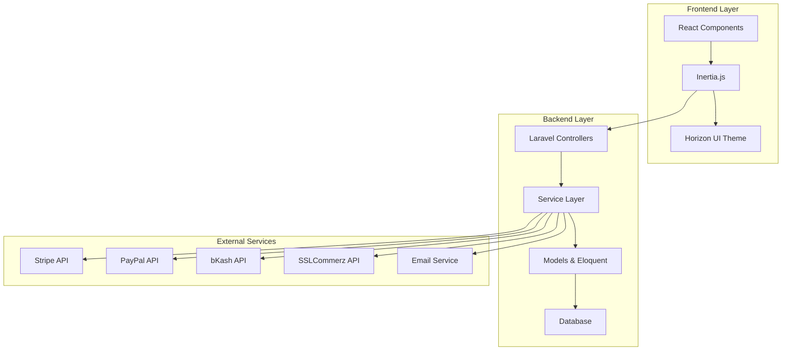
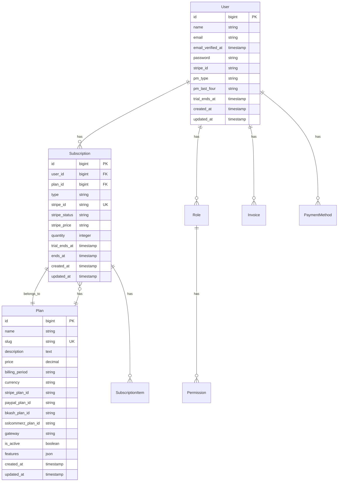

# Design Document

## Overview

The SaaS Subscription Management System is designed as a modern, scalable Laravel 11 application with Inertia.js + React frontend. The system leverages existing Laravel ecosystem packages including Laravel Cashier for subscription management, Spatie Laravel Permission for role-based access control, and integrates with multiple payment gateways. The frontend uses Horizon UI theme components for a professional, responsive interface.

The architecture follows Laravel's MVC pattern with additional service layers for complex business logic, event-driven notifications, and a clear separation between admin and client interfaces.

## Architecture

### High-Level Architecture



### Application Structure

The application follows a modular structure with clear separation of concerns:

- **Authentication Layer**: Laravel Breeze with Inertia.js integration
- **Authorization Layer**: Spatie Laravel Permission for role-based access
- **Business Logic Layer**: Service classes for subscription management
- **Data Layer**: Eloquent models with relationships
- **Presentation Layer**: React components with Horizon UI theme
- **Integration Layer**: Payment gateway adapters and external API clients

## Components and Interfaces

### Backend Components

#### 1. Authentication System
- **AuthController**: Handles login, registration, password reset
- **EmailVerificationController**: Manages email verification process
- **Middleware**: `auth`, `role:admin`, `role:client` for route protection

#### 2. Role and Permission Management
- **RoleController**: CRUD operations for roles
- **PermissionController**: Permission assignment and management
- **RoleMiddleware**: Route-level role verification
- **Models**: Leverages Spatie's Role and Permission models

#### 3. Subscription Management Core
- **SubscriptionController**: Client subscription operations
- **AdminSubscriptionController**: Admin subscription management
- **PlanController**: Subscription plan CRUD operations
- **SubscriptionService**: Business logic for subscription operations
- **Plan Model**: Extended with custom fields for multi-gateway support

#### 4. Payment Gateway Integration
- **PaymentGatewayInterface**: Common interface for all payment providers
- **StripeGateway**: Laravel Cashier integration
- **PayPalGateway**: PayPal API integration
- **BkashGateway**: bKash API integration
- **SSLCommerzGateway**: SSLCommerz API integration
- **PaymentService**: Gateway selection and transaction processing

#### 5. Dashboard and Analytics
- **AdminDashboardController**: Admin metrics and management
- **ClientDashboardController**: Client subscription dashboard
- **AnalyticsService**: Revenue and subscription analytics
- **ReportService**: Invoice and payment history generation

#### 6. Notification System
- **SubscriptionEventListener**: Handles subscription events
- **NotificationService**: Multi-channel notification delivery
- **Email Templates**: Subscription-related email notifications

### Frontend Components

#### 1. Layout Components
- **AdminLayout**: Sidebar navigation with Horizon UI components
- **ClientLayout**: Simplified navigation for client dashboard
- **AuthLayout**: Clean layout for authentication pages
- **GuestLayout**: Public-facing layout

#### 2. Authentication Components
- **LoginForm**: Enhanced with Horizon UI styling
- **RegisterForm**: Registration with role assignment
- **ForgotPasswordForm**: Password reset functionality
- **ResetPasswordForm**: New password setting

#### 3. Admin Dashboard Components
- **AdminDashboard**: Main dashboard with metrics cards
- **UserManagement**: User listing and role assignment
- **SubscriptionManagement**: Subscription overview and management
- **PlanManagement**: CRUD interface for subscription plans
- **AnalyticsCharts**: Revenue and subscription analytics visualization

#### 4. Client Dashboard Components
- **ClientDashboard**: Subscription status and quick actions
- **SubscriptionDetails**: Current plan details and usage
- **BillingHistory**: Invoice listing and download
- **PlanSelection**: Available plans and upgrade options
- **PaymentMethods**: Payment method management

#### 5. Shared Components
- **DataTable**: Reusable table component with sorting/filtering
- **MetricsCard**: Dashboard statistics display
- **Modal**: Confirmation dialogs and forms
- **NotificationToast**: Success/error message display

## Data Models

### Core Models and Relationships



### Extended Models

#### User Model Extensions
- **Billable Trait**: Laravel Cashier integration
- **HasRoles Trait**: Spatie Permission integration
- **Custom Methods**: `isAdmin()`, `isClient()`, `activeSubscription()`

#### Plan Model
- **Gateway Support**: Multiple payment gateway IDs
- **Feature Management**: JSON field for plan features
- **Pricing Logic**: Support for different currencies and billing periods

#### Subscription Model Extensions
- **Multi-Gateway Support**: Extended to work with custom gateways
- **Status Management**: Enhanced status tracking
- **Relationship Methods**: Plan relationship and user access methods

## Error Handling

### Exception Hierarchy

```php
// Custom Exception Classes
PaymentGatewayException
├── StripeException
├── PayPalException
├── BkashException
└── SSLCommerzException

SubscriptionException
├── PlanNotFoundException
├── SubscriptionNotFoundException
└── InvalidSubscriptionStateException

AuthorizationException
├── InsufficientPermissionsException
└── InvalidRoleException
```

### Error Handling Strategy

#### 1. Payment Gateway Errors
- **Gateway Failures**: Graceful fallback to alternative payment methods
- **Transaction Errors**: Detailed logging with retry mechanisms
- **API Timeouts**: Circuit breaker pattern for external API calls
- **User Feedback**: Clear error messages with resolution steps

#### 2. Subscription Errors
- **Plan Changes**: Validation before processing with rollback capability
- **Billing Failures**: Automated retry with notification escalation
- **Access Control**: Graceful degradation of service features

#### 3. Frontend Error Handling
- **API Errors**: Centralized error handling with user-friendly messages
- **Form Validation**: Real-time validation with clear feedback
- **Network Issues**: Offline detection with retry mechanisms
- **State Management**: Error boundaries for React components

## Testing Strategy

### Backend Testing

#### 1. Unit Tests
- **Model Tests**: Eloquent relationships and custom methods
- **Service Tests**: Business logic validation
- **Gateway Tests**: Payment gateway integration with mocking
- **Helper Tests**: Utility functions and calculations

#### 2. Feature Tests
- **Authentication Flow**: Complete auth process testing
- **Subscription Lifecycle**: Create, update, cancel, resume flows
- **Role-Based Access**: Permission verification across routes
- **Payment Processing**: End-to-end payment flow testing

#### 3. Integration Tests
- **External APIs**: Payment gateway integration testing
- **Email Delivery**: Notification system testing
- **Database Transactions**: Complex multi-table operations

### Frontend Testing

#### 1. Component Tests
- **React Components**: Individual component functionality
- **Form Validation**: Input validation and submission
- **User Interactions**: Click handlers and state changes
- **Responsive Design**: Mobile and desktop layout testing

#### 2. Integration Tests
- **Inertia.js Flow**: Page navigation and data passing
- **API Integration**: Frontend-backend communication
- **Authentication State**: Login/logout state management
- **Role-Based UI**: Component visibility based on roles

#### 3. End-to-End Tests
- **User Journeys**: Complete subscription flow testing
- **Payment Processing**: Full payment gateway integration
- **Admin Workflows**: Complete admin task flows
- **Cross-Browser Testing**: Compatibility across browsers

### Testing Tools and Configuration

- **PHPUnit**: Backend unit and feature testing
- **Pest**: Alternative testing framework for cleaner syntax
- **Laravel Dusk**: Browser automation testing
- **Jest/React Testing Library**: Frontend component testing
- **Cypress**: End-to-end testing framework
- **Mock Servers**: Payment gateway API mocking

### Continuous Integration

- **Automated Testing**: Run full test suite on every commit
- **Code Coverage**: Maintain minimum 80% coverage
- **Static Analysis**: PHPStan/Psalm for code quality
- **Frontend Linting**: ESLint and Prettier for code consistency
- **Database Testing**: Separate test database with migrations

## Implementation Considerations

### Performance Optimization
- **Database Indexing**: Optimized queries for subscription and user data
- **Caching Strategy**: Redis for session and frequently accessed data
- **API Rate Limiting**: Throttling for payment gateway requests
- **Frontend Optimization**: Code splitting and lazy loading

### Security Measures
- **Payment Security**: PCI compliance considerations
- **Data Encryption**: Sensitive data encryption at rest
- **API Security**: Rate limiting and request validation
- **Role Verification**: Multi-layer permission checking

### Scalability Considerations
- **Queue System**: Asynchronous processing for payments and notifications
- **Database Optimization**: Proper indexing and query optimization
- **CDN Integration**: Static asset delivery optimization
- **Microservice Readiness**: Modular design for future service separation